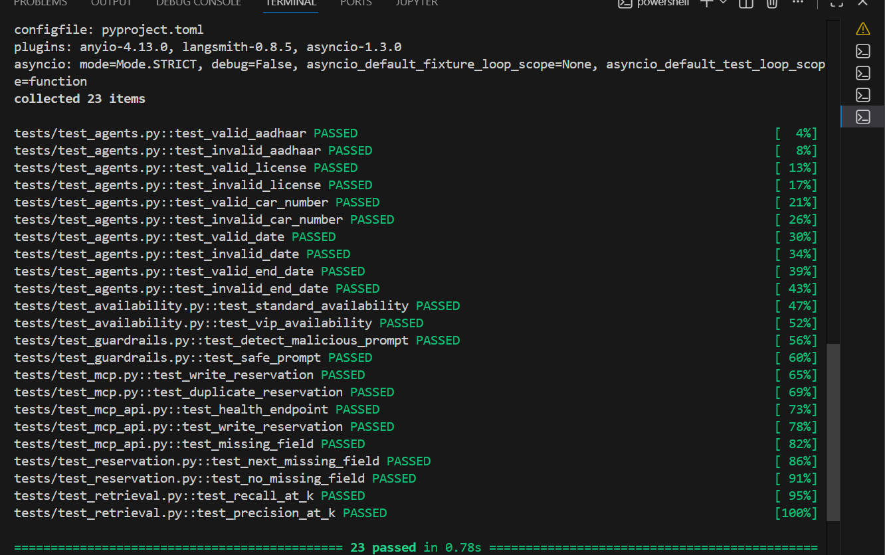
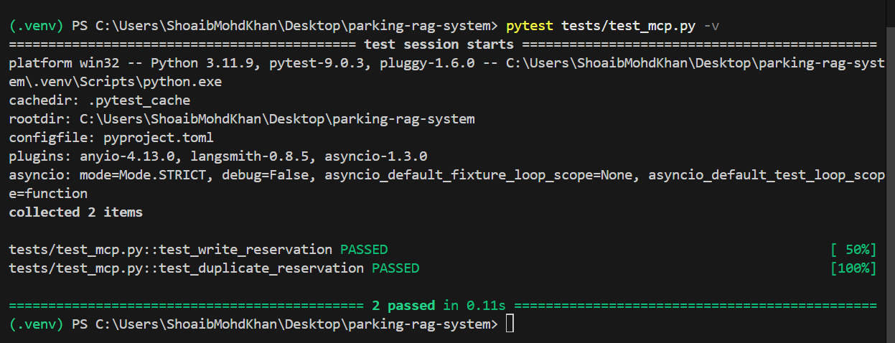
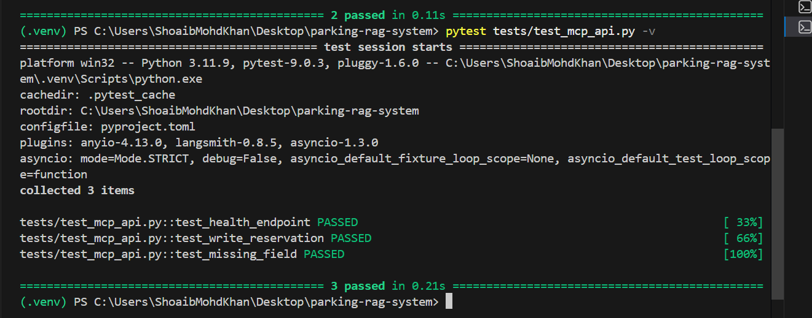

Stage 3 — MCP Server Integration for Reservation Processing
Overview

Stage 3 extends the Intelligent Parking Reservation System by introducing an MCP-style server architecture using FastAPI. The primary objective of this stage is to automatically process approved parking reservations and persist them in a secure storage layer. Once a reservation is approved by the administrator through the Human-in-the-Loop workflow implemented in Stage 2, the approval agent forwards the reservation details to the MCP server for processing.

This stage establishes a service-oriented architecture where reservation processing is separated from chatbot and approval functionalities. Such a design improves modularity, scalability, maintainability, and prepares the system for orchestration in Stage 4 using LangGraph.

Objectives

The key objectives of Stage 3 are:

Implement a lightweight MCP-style server using FastAPI.
Receive approved reservations through HTTP requests.
Validate incoming reservation data.
Prevent duplicate reservation entries.
Store confirmed reservations in persistent storage.
Ensure secure and reliable reservation processing.
Provide monitoring capabilities through a health-check endpoint.
System Architecture

The Stage 3 workflow consists of the following components:

User Chatbot Agent
Collects reservation information from users.
Validates user inputs.
Creates reservation requests.
Approval Agent
Reviews pending reservations.
Approves or rejects reservation requests.
Sends approved reservations to the MCP server.
MCP Server
Receives approved reservations.
Validates request payloads.
Processes reservation data.
Forwards data to the storage layer.
Reservation Writer
Formats reservation records.
Prevents duplicate entries.
Writes confirmed reservations to storage.
Storage Layer
Stores approved reservations permanently.
Maintains historical reservation records.
Features Implemented
FastAPI MCP Server

The MCP server was implemented using FastAPI and exposes the following endpoints:

Health Endpoint
GET /health

Purpose:

Verify server availability.
Support monitoring and diagnostics.

Response:

{
  "status": "healthy"
}
Reservation Processing Endpoint
POST /write-reservation

Purpose:

Accept approved reservation data.
Validate required fields.
Trigger reservation writing process.
Reservation Storage

Approved reservations are stored in:

data/storage/confirmed_reservations.txt

Record format:

Reservation ID | Name | Car Number | Reservation Period | Approval Timestamp

Example:

RES-2026-0001 | Shoaib Khan | TS09AB1234 | 2026-07-01 to 2026-07-03 | 2026-07-01 10:32:15
Security and Reliability Features

Several measures were implemented to improve reliability and security:

Request Validation
Required field verification.
Missing field detection.
Structured API responses.
Duplicate Reservation Prevention
Checks existing records before writing.
Prevents duplicate reservation entries.
Error Handling
Handles invalid requests gracefully.
Returns meaningful error messages.
Health Monitoring
Dedicated health endpoint.
Supports deployment monitoring and troubleshooting.
Technologies Used

The following technologies were used during Stage 3:

Python
FastAPI
Uvicorn
Requests
JSON
Text File Storage
pytest
Testing

Automated testing was implemented using pytest.

MCP Writer Tests
Reservation writing validation.
Duplicate reservation detection.
API Tests
Health endpoint testing.
Reservation endpoint testing.
Missing field validation testing.
End-to-End Testing

The complete workflow was tested:

User creates reservation.
Reservation enters pending queue.
Administrator approves reservation.
Approval agent sends data to MCP server.
MCP server processes reservation.
Reservation stored successfully.
Results

Stage 3 successfully introduced a fully functional MCP-style server into the Intelligent Parking Reservation System. The server receives approved reservations, validates incoming data, prevents duplicate entries, and persists reservation records reliably. The architecture is modular, scalable, and prepared for advanced workflow orchestration in Stage 4.

Future Scope

The next stage will focus on:

Stage 4 — LangGraph Orchestration
Graph-based workflow management.
Multi-node agent orchestration.
Automated routing between components.
Unified reservation processing pipeline.
End-to-end workflow testing and optimization.
Conclusion

Stage 3 successfully bridges the gap between human approval workflows and persistent reservation storage through an MCP-style FastAPI server. The solution provides secure reservation processing, reliable data persistence, API-based communication, and a scalable architecture suitable for enterprise-grade workflow orchestration.
 
## Sample working of the application.
 
Pytest Passed
 

 
MCP Server:

 
Test MCP :

 
Test MCP API

